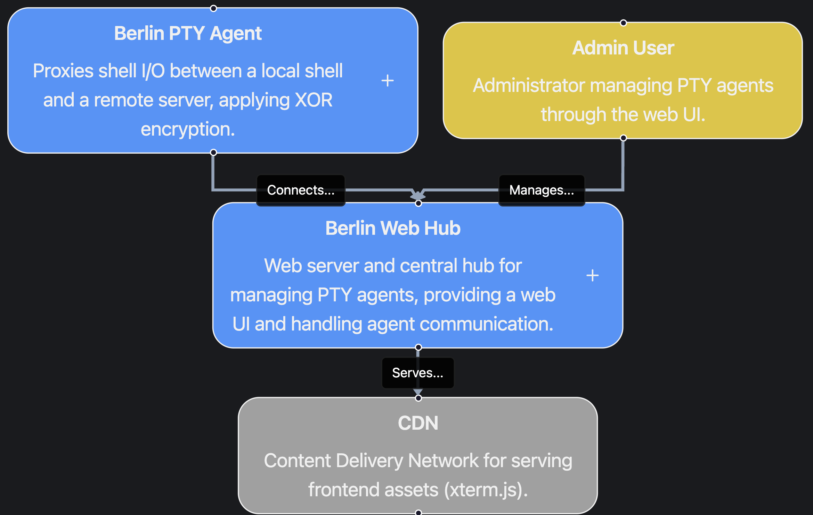
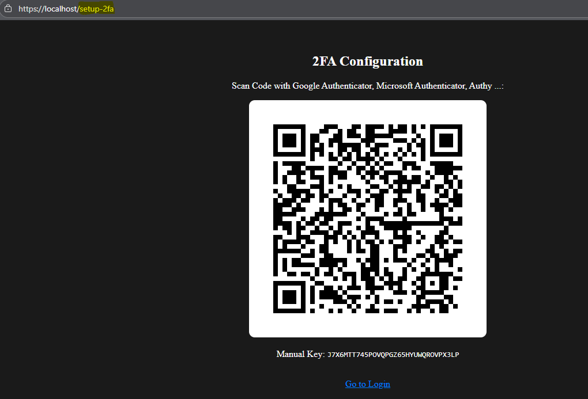
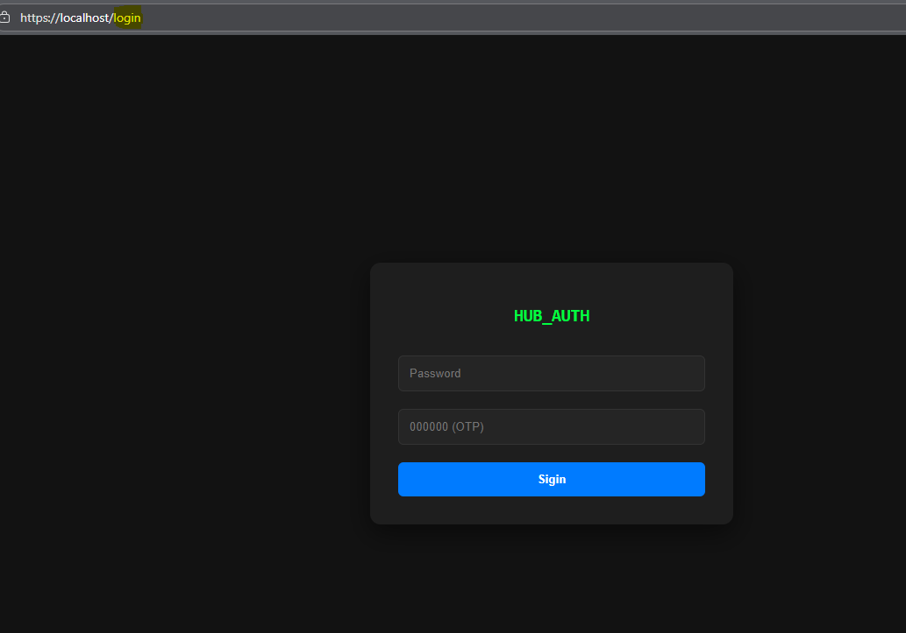
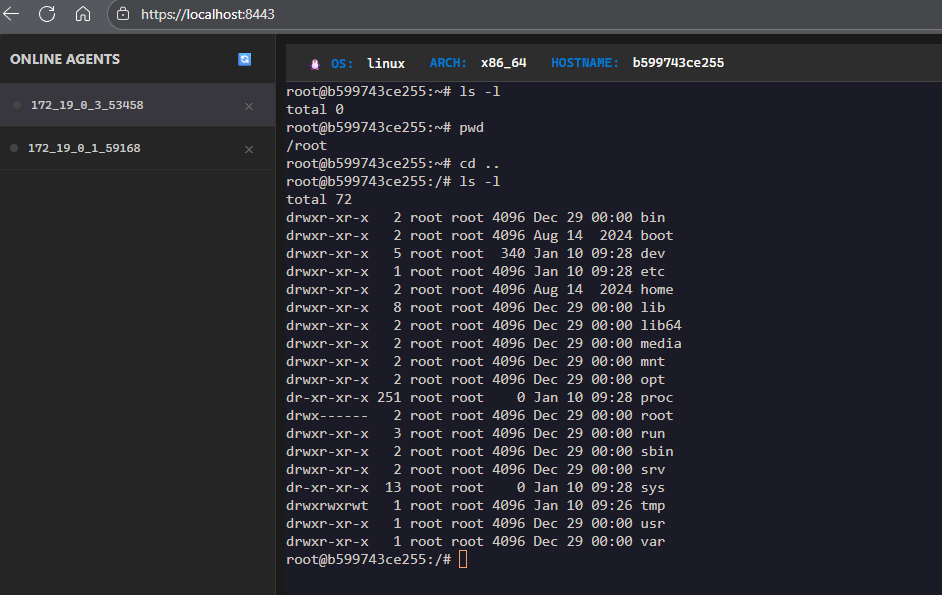
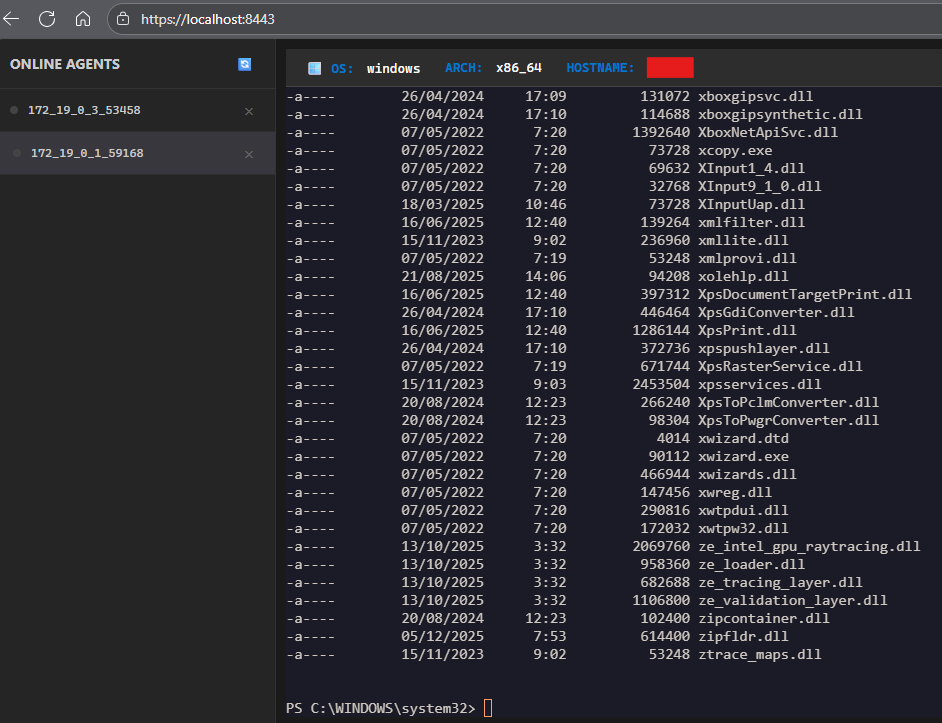
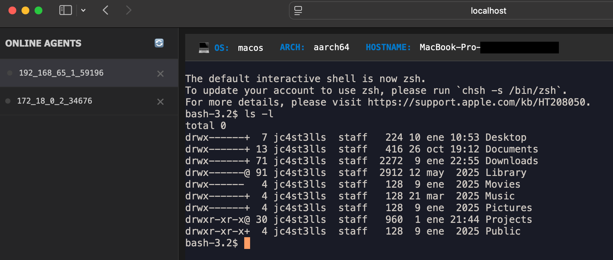

# 🛰️ BerlinRC — Rust Terminal Hub & Agent

BerlinRC is a lightweight Rust project that provides a single web UI to
manage multiple remote terminal sessions. It includes a hub (`berlinweb`),
an agent (`berlinpty`) and a small protocol crate (`berlinproto`) that
contains shared helpers (XOR stream obfuscation and TOTP utilities).



**Highlights**
- Web UI with WebSocket-backed terminal proxying
- Agent that spawns a local PTY and tunnels it to the hub
- Built-in TOTP (2FA) support and TLS via `rustls`

## Repository layout

- `berlinweb/` — Hub server (Axum + Tokio). Manages agents, serves the
  web UI, and provides authentication + WebSocket endpoints.
- `berlinpty/` — Agent binary. Spawns a PTY (PowerShell on Windows,
  bash on Unix) and proxies I/O to the hub over TCP.
- `berlinproto/` — Shared crate with `XorCipher`, TOTP helpers and
  handshake types used by both components.

## Quick start (development)

Prerequisites: Rust toolchain (stable) and cargo.

1. Build and run the hub (development mode):

```bash
cd berlinweb
cargo run
```

2. Build and run an agent (point to hub IP:PORT):

```bash
cd berlinpty
cargo run -- 127.0.0.1:80
```

The hub listens on `BERLINRC_WEB_PORT` (default 443) for HTTPS and
`BERLINRC_HUB_PORT` (default 80) for agent TCP connections. See the
Environment Variables section below for details.

### Development TLS (local)

For local development you can reuse the sample certificates included in
the repo (`test_pem.cert` / `test_pem_b64.cert`). The server accepts TLS
PEM content via `BERLINRC_CERT` and `BERLINRC_KEY` environment variables.

Example (use raw PEM files):

```bash
export BERLINRC_CERT="$(cat ./test_pem.cert)"
export BERLINRC_KEY="$(cat ./test_pem.key)" # use matching key file
cd berlinweb
cargo run
```

Or set the base64-encoded versions into `BERLINRC_CERT` / `BERLINRC_KEY`
— the `berlinweb` config will accept either raw PEM or base64-encoded
values.

## Environment variables

All configuration is read from environment variables with sane defaults.
Key variables:

- `BERLINRC_PASSWORD` — Web UI password (default: `12345678`).
- `BERLINRC_OTP_SECRET` — Base32 secret for TOTP. If omitted the server
  will generate one at startup.
- `BERLINRC_CERT` — TLS certificate PEM content (or base64-encoded PEM).
- `BERLINRC_KEY` — TLS private key PEM content (or base64-encoded PEM).
- `BERLINRC_WEB_PORT` — HTTPS listen port (default: `443`).
- `BERLINRC_HUB_PORT` — Agent TCP listen port (default: `80`).

Set env vars directly or via a `.env`/systemd unit depending on your
deployment.

## 2FA (TOTP) setup

1. Start the hub and visit `https://<host>/setup-2fa`.
2. Scan the QR code with an authenticator app (Google Authenticator,
   Authy, etc.) and save the generated secret.
3. Use the `BERLINRC_OTP_SECRET` env var to set the secret for production
   deployments (store it securely).



## Security notes

- XOR obfuscation: The project uses a simple stream-based XOR cipher to
  obfuscate traffic between agent and hub. This is NOT cryptographically
  secure. Treat it as a lightweight obfuscation layer only — rely on TLS
  for real confidentiality and integrity.
- TLS is required for the web UI — ensure you provide valid certs in
  production.
- Keep the OTP secret and web password secure; rotate them if leaked.

## Running in production

- Provide real TLS certificates (Let’s Encrypt or your PKI) via
  `BERLINRC_CERT` and `BERLINRC_KEY`.
- Run `berlinweb` on a machine reachable by browsers; run `berlinpty`
  agents on endpoints you control.
- Consider using a reverse proxy (Nginx/Caddy) to manage HTTPS and
  provide additional protections (rate limiting, IP filtering).

## Development tips

- Run `cargo fmt` and `cargo clippy` to keep code clean.
- Tests for `berlinproto` live in the crate and can be run with:

```bash
cd berlinproto
cargo test
```


## Screenshots







## License

This repository is provided for educational/internal use.


